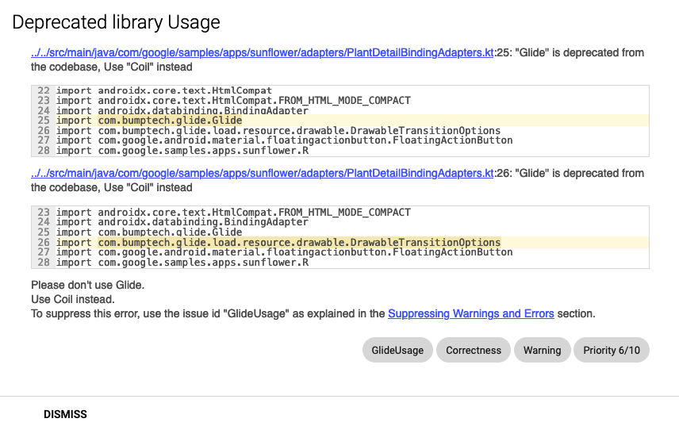

Let’s say your app uses `glide` for loading images. Upon recently you have stumbled upon the newer library `coil`.
Coil is lightweight, easy to use and entirely written in kotlin. You have decided to adapt `coil` and migrate the usages of `glide` to `coil`.

So, instead of migrating all the usages in one go, you can take a stepwise action. You can show lint warnings on the usages of `glide`. 
Migration can be considered as a next step.

For today’s blog, let’s look at `android/sunflower` which uses `glide` for loading images. We’ll show `lint` warnings for the `glide` usages.

## Basics on lint.

Lint is a code scanning tool that can help you to identify and correct the structural problems of your code without having to execute the app or write unit-tests.

## Show me code

Let's inspect the same with android's famous open-sourced project [android/sunflower](https://github.com/android/sunflower).

### Step 1: Clone the repository using HTTPS or SSH.

```shell
git clone git@github.com:android/sunflower.git
```

### Step 2: Create a new module `custom-lint` 

2.1 `build.gradle` file in `custom-lint`

```shell
plugins {
    id 'java-library'
    id 'kotlin'
}

dependencies {
    compileOnly "com.android.tools.lint:lint:26.5.0"
    testImplementation "com.android.tools.lint:lint-api:26.5.0"
    testImplementation "com.android.tools.lint:lint-tests:26.5.0"
}
// Don’t worry, we’ll come back to this part in step-4.
// This is a service loader mechanism of registering lint. This part is essential.
// Later we'll create a new class called LintRegistry
// for now, update this with your package name.
jar {
    manifest {
        attributes("Lint-Registry-v2": "com.jain.ullas.custom_lint.LintRegistry") 
    }
}
```
2.2 Make sure to include `custom-lint` in `settings.gradle`

```shell
include ‘:custom-lint’
```

2.3 Add `lintChecks` to `:app` module inside dependencies block.

```shell
lintChecks project(':custom-lint’)
```

2.4 Add custom `lintOptions` within `android` block of `:app`'s build.gradle

```shell
lintOptions {
    abortOnError false
    htmlReport true
}
```


### Step 3: Create a lint detector that captures the usage of `glide` imports.


```kotlin
@Suppress("UnstableApiUsage", "SameParameterValue")
class GlideUsageDetector : Detector(), Detector.UastScanner {

    override fun getApplicableUastTypes() = listOf(UImportStatement::class.java)

    override fun createUastHandler(context: JavaContext) = GlideImportHandler(context)

    /**
     * Visits the import statements in either `java`/`kotlin` class.
     * If this import statement string starts with "com.bumptech.glide",
     * that means, it has "Glide" library usage.
     * This usage will be thrown as warning in the lint.
     * Exact warning can be seen in the unit-test for this class.
     */
    class GlideImportHandler(private val context: JavaContext) : UElementHandler() {

        override fun visitImportStatement(node: UImportStatement) {
            val import = node.importReference ?: return
            val importString = import.asSourceString()
            if (importString.startsWith(GLIDE_LIBRARY_IMPORT_PREFIX)) {
                context.report(
                    ISSUE_GLIDE_USAGE_PATTERN, node,
                    context.getLocation(import),
                    "\"Glide\" is deprecated from the codebase, Use \"Coil\" instead")
            }
        }
    }

    companion object {
        @JvmField
        val ISSUE_GLIDE_USAGE_PATTERN = Issue.create(
            id = "GlideUsage",
            briefDescription = "Deprecated library Usage",
            explanation =
            """
                Please don't use Glide. 
                Use Coil instead.
            """,
            category = Category.CORRECTNESS,
            priority = 6,
            severity = Severity.WARNING,
            implementation = Implementation(
                GlideUsageDetector::class.java,
                EnumSet.of(Scope.JAVA_FILE, Scope.TEST_SOURCES)
            )
        )

        private const val GLIDE_LIBRARY_IMPORT_PREFIX = "com.bumptech.glide"

    }
}
```

### Step 4: Create a custom lint-registry so that gradle can execute your custom lint checks.

Lint will instantiate this class and ask it to provide a list of issues. These are then merged with lint's other issues when lint performs its analysis.

```kotlin
@Suppress("UnstableApiUsage")
class LintRegistry : IssueRegistry() {

    override val issues: List<Issue>
        get() = listOf(ISSUE_GLIDE_USAGE_PATTERN)

    override val api: Int = com.android.tools.lint.detector.api.CURRENT_API
}
```

### Step 5: Last important step, let’s add unit-tests.

Test case-1 `testImportKotlin()` captures the usages of `glide` in kotlin files.
Test case-2 `testImportJava()` captures the usages of `glide` in java files.
Note that mentioning "com.bumptech.glide" inside a comment has no effect.

```kotlin
@Suppress("UnstableApiUsage")
class GlideUsageDetectorTest {
    @Test
    fun testImportKotlin() {
        lint().files(
            kotlin(
                """
                    package test.pkg
                    import com.bumptech.glide.Glide
                    import com.bumptech.glide.load.resource.drawable.DrawableTransitionOptions
                    class TestClass1 {
                        // In a comment, mentioning "com.bumptech.glide" has no effect
                        private fun someMethod(): Int {
                            return 0
                        }
                    }
                    """
            ).indented()
        )
            .issues(GlideUsageDetector.ISSUE_GLIDE_USAGE_PATTERN)
            .run()
            .expect(
                """
                    src/test/pkg/TestClass1.kt:2: Warning: "Glide" is deprecated from the codebase, Use "Coil" instead [GlideUsage]
                    import com.bumptech.glide.Glide
                           ~~~~~~~~~~~~~~~~~~~~~~~~
                    src/test/pkg/TestClass1.kt:3: Warning: "Glide" is deprecated from the codebase, Use "Coil" instead [GlideUsage]
                    import com.bumptech.glide.load.resource.drawable.DrawableTransitionOptions
                           ~~~~~~~~~~~~~~~~~~~~~~~~~~~~~~~~~~~~~~~~~~~~~~~~~~~~~~~~~~~~~~~~~~~
                    0 errors, 2 warnings
                """
            )
    }

    @Test
    fun testImportJava() {
        lint().files(
            java(
                """
                    package test.pkg;
                    import com.bumptech.glide.Glide;
                    public class TestClass2 {
                        // In a comment, mentioning "com.bumptech.glide" has no effect
                        private static String SOME_STRING = "Ignore non-word usages: com.bumptech.glide";
                    }
                    """
            ).indented()
        )
            .issues(GlideUsageDetector.ISSUE_GLIDE_USAGE_PATTERN)
            .run()
            .expect(
                """
                    src/test/pkg/TestClass2.java:2: Warning: "Glide" is deprecated from the codebase, Use "Coil" instead [GlideUsage]
                    import com.bumptech.glide.Glide;
                           ~~~~~~~~~~~~~~~~~~~~~~~~
                    0 errors, 1 warnings
                    """
            )
    }
}
```

### Step 6: Finally, run lint checks and you can see the warnings in the generated `html` output

```shell
./gradlew :app:lintDebug
```

Generated html reports can be found in `/sunflower/app/build/reports/lint-results-debug.html`


## References

[Lint API guide](https://googlesamples.github.io/android-custom-lint-rules/api-guide.html)
[Google-sample for custom lint](https://github.com/googlesamples/android-custom-lint-rules)

